# From Script Tags to Edge Functions

Why web development is so complicated

---
layout: 'intro'
---

# Ansgar Hoyer

- started Web-Development in 2016
- Software Engineer at AOE since 2023
- focus on JavaScript and TypeScript Ecosystem
- lecturer at HSRM


<div class="mt-20">
<p class="flex gap-2">

  <lucide-github class="opacity-50"/>
  <div><a href="https://github.com/AnsgarH1" target="_blank">AnsgarH1</a></div>
</p>
<p class="flex gap-2">
  <lucide-linkedin class="opacity-50"/>
  <a href="https://www.linkedin.com/in/ansgar-hoyer/" target="_blank">Ansgar Hoyer</a>
</p>
 
</div>

<lucide-presentation class="opacity-50"/> [slides.techtalk.ansgar.app](https://slides.techtalk.ansgar.app)


---
layout: center
---

# The Early Days of JavaScript 

---
layout: two-cols-header
---
# JavaScript's Dual Origins

::left::


- **1995**: Netscape creates JavaScript (Brendan Eich)
  - Created in just 10 days
  - Originally named "Mocha", then "LiveScript"

::right::


- **1996**: Microsoft releases JScript for Internet Explorer
  - A reverse-engineered version of JavaScript
  - Similar but with intentional differences

<p class="text-xs text-end text-blue-500">*picture of Bill Gates as reference </p>

---
layout: two-cols-header
---

# The Browser Wars

::left::


## Netscape Navigator
- First commercial browser
- JavaScript as a competitive feature
- Dominant in early web

::right::
<logos-internetexplorer class=" abs-tr mr-80 mt-30 text-25" />

## Internet Explorer
- Microsoft's answer
- Bundled with Windows
- JScript implementation
- Eventually won with IE6

---
layout: center
---


<p class="text-2xl italic text-blue-500">Different APIs, different behaviors, different bugs...</p>

<p class="text-xl italic text-blue-500">Same code would work differently (or not at all) across browsers!</p>

---
layout: default
---
# Birth of ECMAScript


- **1997**: JavaScript standardized as ECMAScript (ECMA-262)
  - European Computer Manufacturers Association
  - Netscape submitted JavaScript for standardization
  - Goal: Create a vendor-neutral, cross-platform language standard

- **Early versions**:
  - ES1 (1997) - Initial standardization
  - ES2 (1998) - Editorial changes
  - ES3 (1999) - Regular expressions, try/catch, etc.
  - ES4 - Abandoned after disagreements
  - ES5 (2009) - JSON, strict mode, many improvements

---
layout: two-cols-header
---

# The Dark Ages (2000-2009)

::left::
- Internet Explorer dominance (IE6)
- Stagnation in browser innovation
- **JavaScript libraries emerge to handle cross-browser issues**:
  - jQuery (2006)
  - Prototype.js
  - MooTools
  - Dojo Toolkit

::right::

```js
// jQuery example - hiding cross-browser complexity
$("#myButton").click(function() {
  $(".elements").fadeIn(500).addClass("active");
});
``` 

---
layout: default
---

# Monolithic Web Frameworks emerged

- Server-side rendered pages with minimal JavaScript
- Tightly coupled frontend and backend code
- Full-stack frameworks handling routing, templates, and database
- "LAMP Stack era"
- typically poor user experience

<div class="flex gap-10 mt-20">
<logos-rails class="text-15"/>
<logos-django class="text-15"/>
<logos-laravel class="text-15"/>
<logos-spring class="text-15"/>
</div>

---
layout: default
---

# Monolithic Web Framework Performance

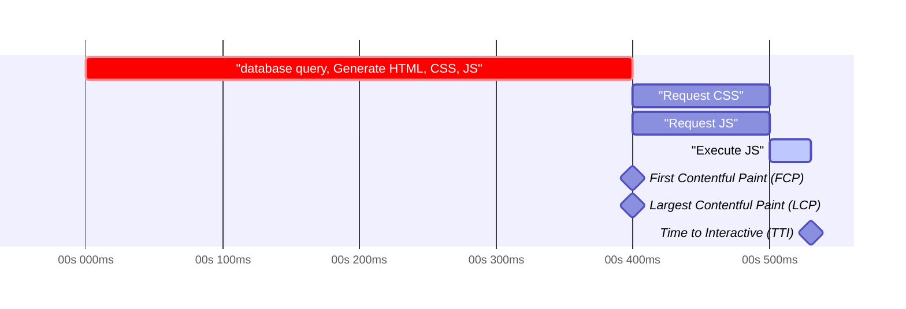

<p class="text-xs text-blue-500 text-end">*simplifed example, times are made up</p>

---
layout: two-cols-header
---

# Renaissance: Modern JavaScript

::left::

**ES6/ES2015**: The biggest update to the language
  - Arrow functions, classes, modules, promises, etc.
  - Annual release cycle begins (ES2016, ES2017)

**New browsers and engines**:s
  - Chrome with V8 (2008)
  - Firefox with SpiderMonkey
  - Browser competition drives JS engine performance

::right::

```js
// ES6 features
const add = (a, b) => a + b;

class Person {
  constructor(name) {
    this.name = name;
  }
  sayHello() {
    return `Hello, I'm ${this.name}`;
  }
}

// Modules
import { Component } from './component';
```

---
layout: default
---

# The rise of cloud computing


- Software moved from on-premise to the cloud
- Cloud providers offer a wide range of services
- Serverless computing became a thing
- CDNS became widely available, Hosting static files became basically free
- Cloud Platforms reselling AWS services but with a nicer UI emerged


<div class="flex gap-10 justify-center mt-10 items-center">

<logos-aws class="text-15"/>
<logos-azure class="text-15"/>
<logos-google-cloud class="text-15"/>
<logos-cloudflare-icon class="text-15"/>
</div>

<div class="flex  gap-10 justify-center mt-15 items-center">
<logos-netlify class="text-10"/>
<logos-vercel class="text-6"/>
<logos-digital-ocean class="text-10"/> 
</div>

---
layout: default
---

# Static Web Pages returned

- only HTML, CSS, JS
- no complex webserver needed, only static file serving
- CDN can serve the files
- Tools like Github-Pages or Netlify-Drop made hosting easier than ever


<p class="text-center pt-40">
<a href="https://app.netlify.com/drop" target="_blank">
<lucide-external-link /> Netlify Drop
</a>
</p>

---
layout: center
class: text-center
---

# Demo Time!

---
layout: iframe-right
url: https://demo-01.techtalk.ansgar.app/
---

# Demo 1: Vanilla JavaScript

<p>Traditional web development with HTML, CSS, and JavaScript
No build tools, no frameworks*</p>


<p class="pt-30">
Code:  <a href="https://github.com/AnsgarH1/techtalk-wiesbaden-21-05-25/tree/main/demos/01-vanilla-js" target="_blank"> <lucide-github /> Demo1</a><br>
</p>
<p>
Web: <a href="https://demo-01.techtalk.ansgar.app" target="_blank"><lucide-external-link /> https://demo-01.techtalk.ansgar.app</a>
</p>

---
layout: default
---

# Demo 1:
## Request Flow

<div class="abs-tr mr-25 mt-10">
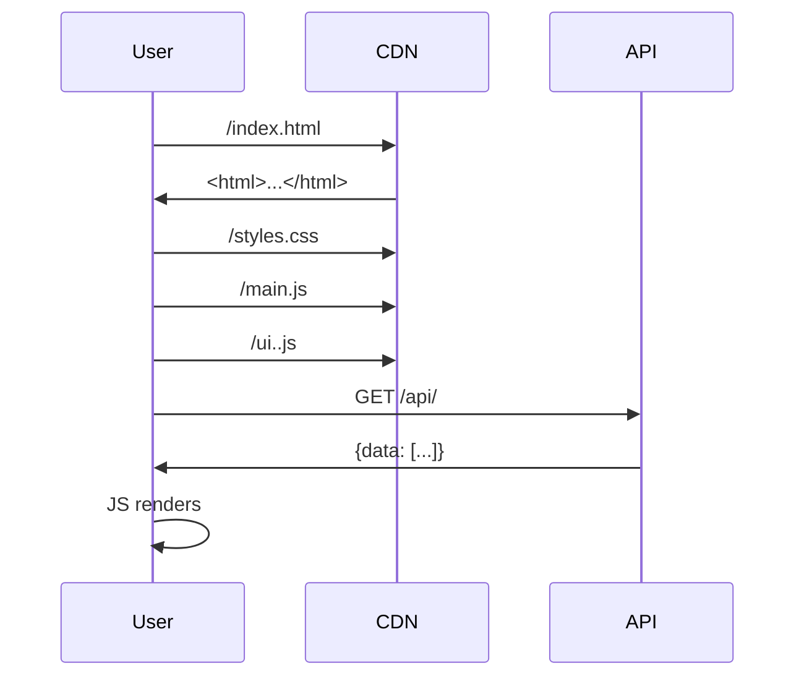
</div>

---
layout: two-cols-header
---
# Demo 1: Vanilla JavaScript

::left::

```mermaid

architecture-beta
    group api[classical]

    service client(lucide:user-round)[user]
    service webserver(server)[web server] in api

    client:B -- T:webserver
```
::right::

```mermaid {scale: 0.7}
architecture-beta

    service client(lucide:user-round)[user]

    group api[actual infrastructure]

    service server(logos-aws-lambda)[Lambda] in api
    service s3(logos-aws-s3)[S3 Bucket] in api
    service cdn(logos-aws-cloudfront)[CDN] in api

    client:B -- T:cdn
    cdn:B -- T:s3
    client:B -- T:server
```


---
layout: default
---
# Demo 1: Vanilla JavaScript

## Web Performance

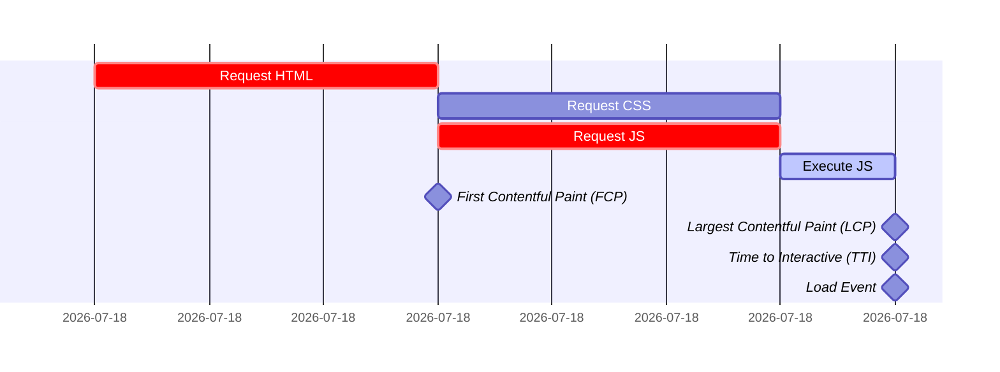


---
layout: center
---

# The Transpiler & Bundler Era 

---
layout: default
---

# The Compatibility Problem

- Modern JavaScript features, but older browsers don't support them
- Businesses need to support legacy browsers (IE11 until recently)
- Can't use latest language features directly

<div class="mt-32 text-center text-blue-500 text-2xl">
How do we write modern code but still support older browsers?
</div>

---
layout: two-cols-header
---

# Enter: Transpilers

::left::

**Transpilers**: Transform modern JavaScript into backward-compatible versions
- **Babel**: The most popular JavaScript transpiler
  - Write ES2015+ code
  - Babel converts it to ES5 for wider browser support

::right::

```js
// Modern JavaScript (input)
const greet = (name) => `Hello, ${name}!`;
let [first, ...rest] = [1, 2, 3, 4];

// Transpiled to ES5 (output)
"use strict";
var greet = function greet(name) {
  return "Hello, ".concat(name, "!");
};
var _ref = [1, 2, 3, 4],
    first = _ref[0],
    rest = _ref.slice(1);
```

---
layout: default
---

# Module Systems & Bundlers

**Problem**: Browser support for modules was inconsistent

**Module formats evolved**:
  - CommonJS (Node.js): **require()** and **module.exports**
  - AMD (RequireJS): For browsers, async loading
  - UMD: Universal Module Definition (works in both)
  - ES Modules: The official standard (**import**/**export**)

**Bundlers**: Package multiple modules into fewer files
  - **Webpack**: Most popular bundler
  - **Rollup**: Focused on ES modules and tree-shaking
  - **Parcel**: Zero-config bundler 

---
layout: default
---

# Webpack

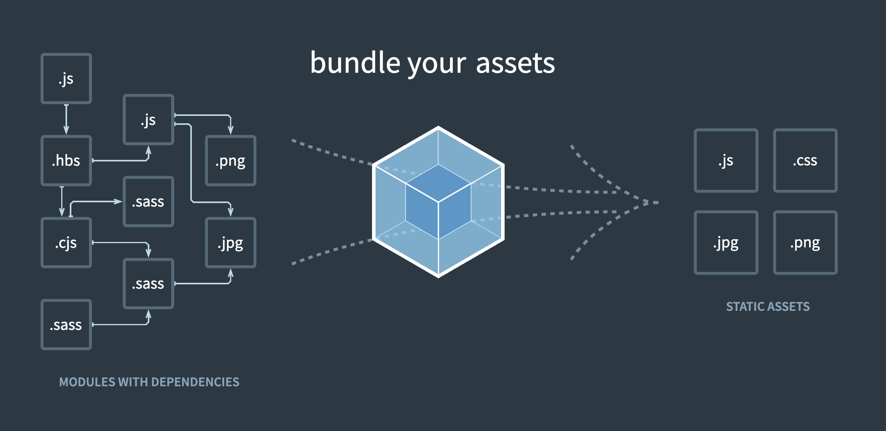

---
layout: two-cols-header
---

# TypeScript: Type Safety for JavaScript

::left::

- **Released by Microsoft in 2012**
- **Key benefits**:
  - Static type checking
  - Better IDE support
  - Self-documenting code
  - Catches errors at compile time

::right::

```ts
// TypeScript example
interface User {
  id: number;
  name: string;
  email: string;
  role: 'admin' | 'user' | 'guest';
}

function sendEmail(user: User, message: string): Promise<boolean> {
  // Type-safe implementation
  return fetch(`/api/email/${user.id}`, {
    method: 'POST',
    body: JSON.stringify({ message })
  }).then(res => res.json());
}
```
---
layout: two-cols-header
---

# JavaScript Runtimes


Each runtime provides different APIs and capabilities!

::left::

## Browser

- The original JS environment
  - V8 (Chrome/Edge)
  - SpiderMonkey (Firefox)
  - JavaScriptCore (Safari)

<div class="flex gap-10 mt-20">
<logos-v8 class="  text-15" />
<logos-spidermonkey-icon class="text-15 dark:fill-white" />
<logos-webkit class="text-15" />
</div>

::right::

## Server-side

- JavaScript beyond the browser
  - Node.js (2009) - Server-side JavaScript
  - Deno (2018) - Secure by default
  - Bun (2023) - Performance focused 
<div class="flex gap-10 mt-20">
<logos-nodejs class="text-15" />
<logos-deno class="text-15" />
<logos-bun class="text-15" />
</div>

---
layout: default
---


# Package Managers: Dependency Hell

<div class="flex gap-10 mt-20">
  <div>
  <logos-npm class="text-10 mb-5"/>

**npm** (2010): Node Package Manager
  - Revolutionized code sharing
  - *node_modules* became infamous

  </div>
<div>

<logos-yarn class=" text-10 mb-5"/>

**Yarn** (2016): Faster, more reliable
- Introduced lockfiles
- Parallel installations


</div>
<div>
<logos-pnpm class=" text-10 mb-5"/>

**pnpm** (2017): Disk space efficient
- Symlinks to a central store
- Strict dependency resolution
  
</div>
</div>
<div class="mt-8 text-center text-blue-500">
The average project now has hundreds of dependencies!
</div>
<p class="text-end text-4"> * <logos-bun /></p>
---
layout: center
---

# Build Systems: Taming the Complexity

---
layout: default
---

# The Configuration Nightmare

<ul class="mt-15 text-xl">
<li> Complex configuration files </li>
<li> Countless plugins </li>
<li>  Tedious setup </li>
<li>  Slow builds</li>
</ul>


<div class="text-center text-blue-500 text-lg mt-32">
Development became about configuring tools rather than writing code!
</div>

---
layout: two-cols-header
---

# Modern Build Systems

::left::


- **Parcel** (2017)
  - Zero-config bundler for any project
- **Vite** (2020)
  - Lightning-fast dev server using ES modules
- **Turbopack** (2022)
  - Announced as "successor to Webpack"
- **Rspack, Rsbuild** (2022)
  - Another successor to Webpack
- 🪦 RIP : Create React App, Vue CLI

::right::

```bash
# Complex setups got abstracted by simple cli-commands
npm create vite@latest -- --template react-ts
# or
npm create parcel react-client my-parcel-app
# or
npm create rsbuild@latest
# or with Next.js
npx create-next-app@latest
```

<p class="text-xs text-right text-blue-500">* please don't actually use npm anymore</p>


---
layout: two-cols-header
---

# Vite: Revolution in DX
<logos-vitejs class="abs-tr mt-10 mr-20 text-20"/>

::left::

- Developed by Evan You (Vue creator)
- **Key innovations**:
  - Uses native ES modules in development
  - Only bundles for production
  - Incredibly fast hot module replacement
  - Framework-agnostic

::right::

```js
// vite.config.js - Simple configuration
import { defineConfig } from 'vite'
import react from '@vitejs/plugin-react'

export default defineConfig({
  plugins: [react()],
})
```

---
layout: default
---

# Linting & Formatting

<div class="mt-20 grid grid-cols-3 gap-4">
<div>

<h3 class="mb-5"> <logos-eslint class="mr-3" />ESLint </h3>
- Catch bugs and enforce conventions
- Pluggable architecture
- Hundreds of rules available

</div>
<div>

<h3 class="mb-5"> <logos-prettier class="mr-3" /> Prettier</h3>

- Opinionated code formatting
- End debates about code style
- Consistent formatting across teams

</div>
<div>

<h3 class="mb-5">Husky & lint-staged </h3>

- Enforce at commit time
- Pre-commit hooks
- Only check changed files

</div>
</div>

<div class="mt-20 text-center text-blue-500">
More tools to learn, configure, and maintain...
</div> 

---
layout: center
---

<p class="text-center text-blue-500">
even with new technologies, writing vanilla JavaScript has still its limits...
</p>

---
layout: section
---

# Single-Page Applications

<div class="flex justify-center gap-20 mt-20">
<logos-react class="text-15"/>
<logos-vue class="text-15"/>
<logos-angular class="text-15"/>
</div>

---
layout: two-cols-header
---

# Single-Page Applications: Component Composition

::left::

<h3 class="pb-3">Building Blocks</h3>

- **Reusable Components**
  - Self-contained UI pieces
  - Props for configuration
  - Events for communication
- **Component Hierarchy**
  - Parent-child relationships
  - Nested components
  - Component trees

::right::

<h3 class="pb-3">Benefits</h3>

- **Code Reusability**
  - DRY principle
  - Consistent UI patterns
- **Maintainability**
  - Isolated functionality
  - Easier testing
  - Clear responsibilities
- **Development Efficiency**
  - Component libraries
  - Faster UI development
  - Team collaboration

---
layout: two-cols-header
---

# Single-Page Applications: New Paradigms

::left::


<h3 class="pb-3">New Concepts</h3>

- **Client-side routing**
  - Navigation without page reload
  - History API manipulation
- **State management**
  - Redux, Vuex, MobX, Pinia, Zustand
  - Complex client-side data handling
- **Virtual DOM**
  - Efficient UI updates
  - DOM diffing algorithms


::right::

<h3 class="pb-3">Architecture Changes</h3>

- **Frontend-backend separation**
  - APIs instead of server templates
  - JSON over HTML responses
- **Rich client experiences**
  - Animations and transitions
  - Instant feedback
- **New challenges**
  - SEO difficulties
  - Initial load performance
  - JavaScript dependency


---
layout: two-cols-header
---

# Vue.js

"The Progressive JavaScript Framework"

<logos-vue class="abs-tr mt-10 mr-20 text-15"/>

::left::


- **Released by Evan You in 2014**
- **Key features**:
  - Incremental adoption
  - Reactive data binding
  - Template syntax
  - Component system
  - Single File Components

::right::


```vue
<script setup>
import { defineProps } from 'vue';

defineProps({
  user: User,
});

const followUser = (userId) => {
  console.log(`Following user: ${userId}`);
};
</script>
<template>
  <div class="profile">
    
    <h2>{{ user.name }}</h2>
    <p>{{ user.bio }}</p>
    <button @click="followUser(user.id)">Follow</button>
  </div>
</template>

```

---
layout: two-cols-header
---
# React
" The library for web and native user interfaces"

<logos-react class="abs-tr mt-10 mr-20 text-15"/>

::left::


- **Released by Facebook in 2013**
- **Key innovations**:
  - Component-based architecture
  - Virtual DOM for performance
  - Declarative UI programming
  - Unidirectional data flow

::right::

```jsx
type UserProfileProps = {
  user: User
};

function UserProfile({ user }: UserProfileProps) {
  const followUser = (userId) => {
    console.log(`Following user: ${userId}`);
  };
  return (
    <div className="profile">
      
      <h2>{user.name}</h2>
      <p>{user.bio}</p>
      <button onClick={() => followUser(user.id)}>
        Follow
      </button>
    </div>
  );
}
```

---
layout: center
---

# Demo 2: Vue.js Single-Page-Application

Modern single-page application with a fast build system
Client-side rendering with instant HMR

---
layout: iframe-right
url: https://demo-02.techtalk.ansgar.app
---

# Demo 2: Vue.js SPA

<p>Client-side rendered single-page application
Fast development with Vite and Hot Module Replacement</p>


<p class="pt-30">
Code:  <a href="https://github.com/AnsgarH1/techtalk-wiesbaden-21-05-25/tree/main/demos/02-vue-spa" target="_blank"> <ri-github-line /> Demo2</a><br>
</p>
<p>
Web: <a href="https://demo-02.techtalk.ansgar.app" target="_blank">demo-02.techtalk.ansgar.app</a>
</p>


---
layout: default
---
# Demo 1:
## Request Flow

<div class="abs-tr mr-25 mt-10">
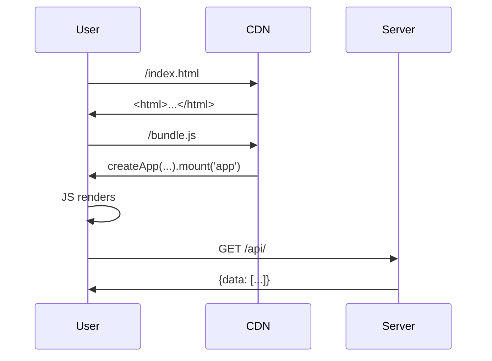
</div>
---
layout: default
---
# Demo 2: Vue.js SPA


```mermaid
architecture-beta
    group api[infrastructure]
    service s3(logos-aws-s3)[S3 Bucket] in api
    service cdn(logos-aws-cloudfront)[CDN] in api
    service client(lucide:user-round)[user]

    client:R -- L:cdn
    cdn:B -- T:s3
```

---
layout: default
---
# Demo 2: Vue.js SPA

## Web Performance

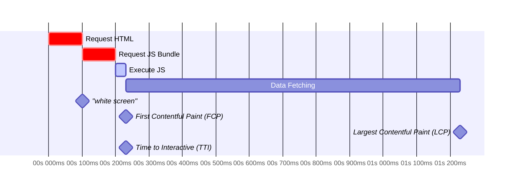


---
layout: default
---
# SPAs are slower than classical MPAs?

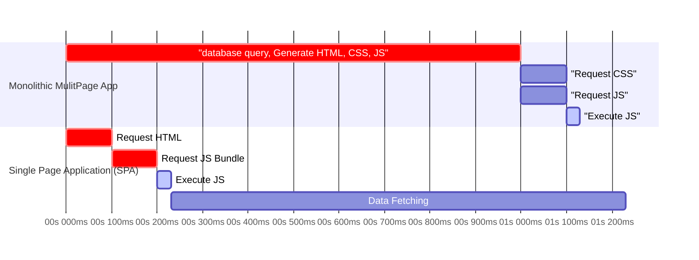

---
layout: default
---

# The Return of the server

- HTML generation is done on the server again
- but: we still use the same frameworks and libraries (React, Vue, Svelte, ...)
- the server sends the HTML to the client
- the client then "hydrates" the static HTML with the JS bundle and continues as SPA
- known as Server-Side Rendering (SSR)

---
layout: default
---

# SSR Performance

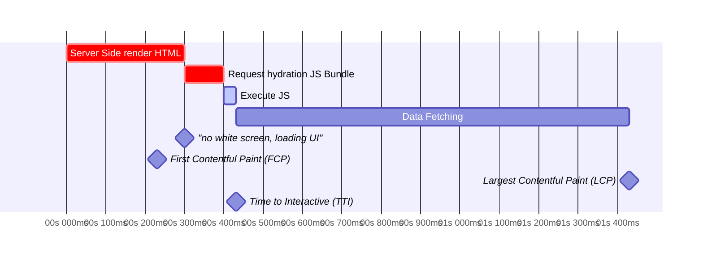
<p class=" text-blue-500 text-center">pure SSR is actually slower than SPAs, but content is shown immediately</p>


---
layout: two-cols-header
---

# Demo 3: React SSR App

- needs Webserver, that renders the React App on the server
- sends the HTML to the client
- client "hydrates" the HTML with the JS bundle and continues as SPA

<p class="pt-30">
Code:  <a href="https://github.com/AnsgarH1/techtalk-wiesbaden-21-05-25/tree/main/demos/03-ssr-react" target="_blank"> <ri-github-line /> Demo3</a><br>
</p>


<div class="abs-br mb-30 mr-30 flex flex-col items-center">

<logos-bun class="text-15"/>
<p class="text-blue-500"> Bun to the rescue!</p>
</div>


---
layout: section
---

# How can we further optimize the performance?

---
layout: two-cols
---


# Improve rendering performance:
<ul class="mt-20">
<v-click> 
  <li>alread load data from api during server render</li>
  <li>run the "server render" already during build time (known as Static Site Generation)</li>
  <li>cache the rendered output to serve it immediately</li>
  <li>stream the html as it gets generated</li>
  <li>break up the side into static and dynamic parts</li>
</v-click>
</ul>

::right::


# Improve infrastructure performance:
<ul class="mt-20">
<v-click>
  <li> we already put the static files near the user by using a CDN</li>
  <li>why not move the api near the user?</li>
  <li>why not move the database near the user?</li>
</v-click>
</ul>

---
layout: section
---

# Improving rendering performance

---
layout: default
---

# The elefant in the room: 
<v-click>
<logos-nextjs class=" mt-10  text-15"/>
</v-click>


<v-click>
<div class="mt-10">

- Runs the web server
- provides the build system
- automatically does all of the performance optimizations
- provides features like routing, image optimization, server-side loading, etc.
</div>
</v-click>


<v-click>
<p> But: <logos-vercel class=" mt-10 ml-10  text-10"/> </p>
</v-click>

<v-click>
<logos-nuxt class="abs-tr mt-10 mr-40 text-7"/>
<logos-svelte-kit class="abs-tr mt-24 mr-10 text-10"/>

</v-click>

---
layout: default
---

# Partial prerendering

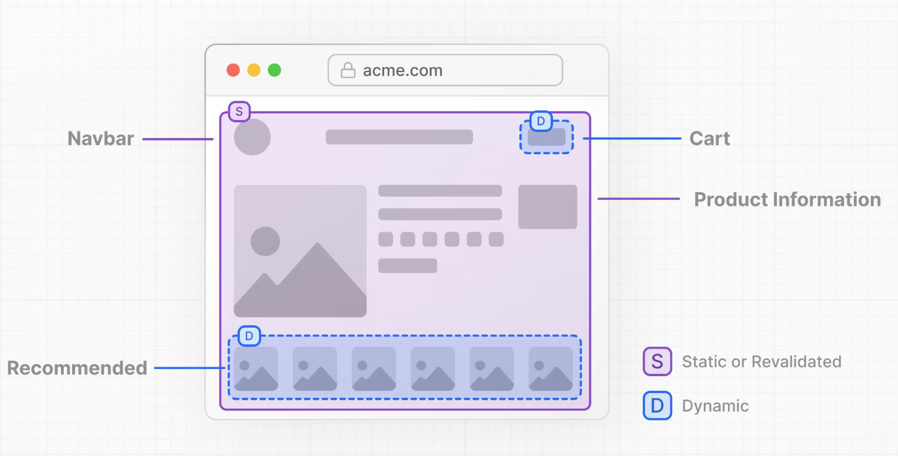

--- 
layout: default
---
# Astro: Islands Architecture

<logos-astro class="abs-tr mt-10 mr-10 text-10"/>

<div class="flex justify-center">

</div>

---
layout: section
---

# Improving infrastructure performance

---
layout: default
---

# Getting the most out of SSR (with PPR)

```mermaid
sequenceDiagram
  participant User as User
  participant Lambda@Edge as Lambda@Edge
  participant CDN as CDN
  participant Server as DB

  User ->> Lambda@Edge: GET /index.html
  Lambda@Edge ->> CDN: GET /_static
  Lambda@Edge ->> Server: sql(...)
  CDN->>Lambda@Edge: <html>...</html>
  Server->>Lambda@Edge: {data: [...]}
  Lambda@Edge->>User: <html><li>...</li></html>


```
---
layout: two-cols-header
---

# Putting the database near the user 

<div class="mt-10 mr-10">


</div>

::left::

- Turso is a Database Platform that utilizes SQLite 
  - allows for embedded database replicas inside the Applications
  - allows for concepts like per tenant databases, branching, etc.

::right::

<div class="abs-br mb-30 w-130">

```mermaid
sequenceDiagram
  participant User as User
  participant Lambda@Edge as Lambda@Edge
  participant CDN as CDN
  participant Server as Turso Platform

  Server->>Lambda@Edge: sync sqlite DB

  User ->> Lambda@Edge: GET /index.html
  Lambda@Edge ->> CDN: GET /_static
  CDN->>Lambda@Edge: <html>...</html>
  Lambda@Edge ->> Lambda@Edge: sql(...)
  Lambda@Edge->>User: <html><li>...</li></html>
  
  Lambda@Edge->>Server: sync sqlite DB

```
</div>

---
layout: section
---
# How to run Frontend Frameworks

---
layout: two-cols-header
---

# How to run Next.js **serverless** without Vercel?

::left::


::right::
<div class="ml-10">

- Next still can get run in a Docker Container
- Only other current options are Cloudflare and Netlify
- running in Docker Container is still possible, but performance varies
- Vercel uses a complex setup of Lambdas, K8s, Cloudflare and edge computing to archive the best performance

</div>

---
layout: section
---

# What next?

---
layout: default
---

# Topics for next time

- React Server Components (and new React Frameworks)
- New JS Tools in Rust 
- JS Fullstack Frameworks (Nuxt, Solid-Start, SvelteKit, ...)
- The mess of all the JS Runtimes that currently exist
- Testing setups
- We somehow didn't even talk about CSS and all the other styling solutions


---
layout: section
---

# Will this get any easier?

---
layout: center
---
<div class="text-center">

# 🤷🏼‍♂️🤷🏼‍♂️

<v-click>
<div class="text-left">

- Modern tools like Bun and Vite simplify the tooling setup
- new Libraries make building performant apps easier than ever
- Infrastructure problems will eventually get solved as well
</div>
</v-click>
</div>
---
layout: center
---

# Thank you!

Slides can be found at [https://techtalk-slides.ansgar.app](https://techtalk-slides.ansgar.app)

- Demos:
  - [http://demo-01.techtalk.ansgar.app](http://demo-01.techtalk.ansgar.app)
  - [http://demo-02.techtalk.ansgar.app](http://demo-02.techtalk.ansgar.app)

- Slides: [https://slides.techtalk.ansgar.app](https://slides.techtalk.ansgar.app)
- Lunchfinder API: [https://api.techtalk.ansgar.app/api/ui](https://api.techtalk.ansgar.app/api/ui)
- Code, Slides and Demos: [https://github.com/AnsgarH1/techtalk-wiesbaden-21-05-25](https://github.com/AnsgarH1/techtalk-wiesbaden-21-05-25)